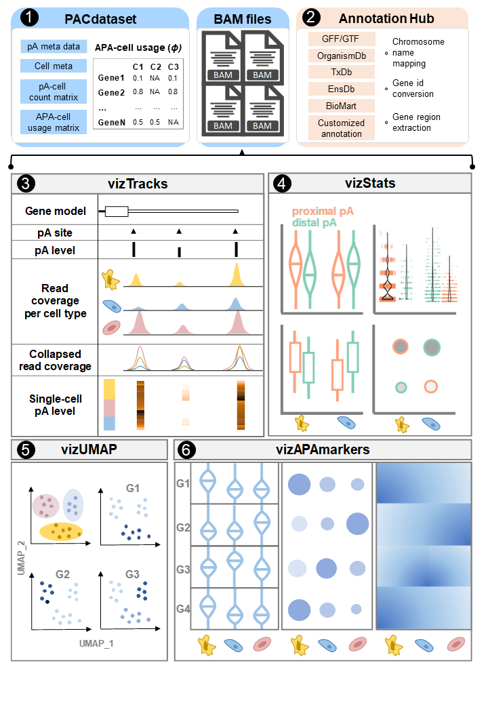

# vizAPA v0.1.0 (released on 2023/10/12)
vizAPA: visualizing dynamics of alternative polyad-enylation from bulk and single-cell data

## About
Alternative polyadenylation (APA) is a widespread post-transcriptional regulatory mechanism across all eukaryotes. With the accumulation of genome-wide APA sites, especially those with sin-gle-cell resolution, it is imperative to develop easy-to-use visualization tools to guide APA analysis. We developed vizAPA for visualizing APA dynamics from bulk and single-cell data. vizAPA imports various types of APA data and genome annotation sources through unified data structures. vizAPA also enables identification of APA markers with differential APA usage. Four unique modules are provided in vizAPA for visualizing APA dynamics across cell groups and at the single-cell level. 

* The vizAPA package mainly consists of six modules.



(1) Data input module that imports different types of APA data through a compact data structure PACdataset. 
(2) Genome annota-tion module that builds internally an annoHub data structure for adapting to different genome annotation sources from different species. 
(3) Visualization module vizTracks that generates a ge-nome-browser-like plot, which utilizes tracks to display different types information related to APA, including gene models, positions and expression levels or usages of poly(A) sites, read alignments, and single-cell read counts. 
(4) Visualization module vizStats that generates various charts, including violin plot, box plot, bubble plot, and dot plo, to visualize usages of any given poly(A) site(s) (e.g., proximal and distal sites) in a gene across different cell groups. 
(5) Visualization module vizUMAP that learns two-dimensional embeddings for visualizing clusters of cells with simi-lar APA expression or usage profiles. 
(6) Visualization module vizAPAmarkers that identifies genes with differential APA usages (called APA markers) and generate rich plots, including violin plot, heat map, bubble plot, and UMAP plot, for the visualization of selected APA markers.

## Getting started
### Mandatory
* R (>=4.2.2) (https://www.r-project.org/) is recommended.

### Required R Packages
* Matrix, movAPA, GenomicRanges, ggplot2, ggbio, tidyr, dplyr, biomaRt, testthat, RColorBrewer, GenomicFeatures, Rsamtools, SeuratObject, bamsignals, AnnotationFilter, GenomeInfoDb, IRanges, magrittr, methods

### Installation
* Install the R package using the following commands on the R console:

```
install.packages("devtools")
require(devtools)
install_github("BMILAB/vizAPA")
library(vizAPA)
browseVignettes('vizAPA')

##or you can download ZIP, and then unzip
devtools::install_local("your_path_of_vizAPA-master.zip", build_vignettes = TRUE)
```

## Application examples
Vignettes can be found [here](https://github.com/BMILAB/vizAPA/tree/master/inst/doc). Or you can also browse the vignette using the following command on the R console:
```
browseVignettes('vizAPA')
```
### Using_vizAPA_a_minimal_tutorial
This tutorial takes a `PACdataset` object storing a list of poly(A) sites as input and describes some simple but commonly used functions of vizAPA.

### Using_vizAPA_vizStats_a_full_tutorial
This tutorial takes a `PACdataset` object storing a list of poly(A) sites as input and describes full usages of series function related to `vizStats`, `vizUMAP`, and `vizAPAmarkers` in `vizAPA`.
 `vizStats`, `vizUMAP`, and `vizAPAmarkers` are used for making statistics and visualization of pA read counts and APA usages across cells or cell types.

### Using_vizAPA_vizTracks_a_full_tutorial
This tutorial takes a `PACdataset` object storing a list of poly(A) sites and BAM files as input and describes full usages of series function related to `vizTracks` in `vizAPA`.

### Read_PAC_data_from_Sierra
This documentation describes how to use `Sierra` to detect poly(A) sites from single-cell RNA-seq data, read the poly(A) sites data from `Sierra`, and then analyze it with `vizAPA`. We used  single-cell RNA sequencing data from peripheral blood mononuclear cells (PBMCs) for demonstration. The specific procedure for Sierra identification and quantification of poly(A) sites can be found in:[Sierra](https://github.com/VCCRI/Sierra/wiki/Sierra-Vignette)

### Read_PACs_data_from_scAPAtrap
This documentation describes how to use vizAPA to visualize poly(A) sites (pAs) identified from `scAPAtrap`. Here we used scRNA-seq data from peripheral blood mononuclear cells (PBMCs) for demonstration. Please follow the tutorial of [scAPAtrap](https://github.com/BMILAB/scAPAtrap/) first to identify pAs from scRNA-seq. The output of scAPAtrap is an RDA file containing a pA (i.e., peak in scAPAtrap) list with peaks' meta data and peaks' count data.


## Citation
If you are using vizAPA, please cite: Xingyu Bi#, Wenbin Ye#, Xin Cheng, Ning Yang, and Xiaohui Wu*: vizAPA: visualizing dynamics of alternative polyadenylation from bulk and single-cell data.
